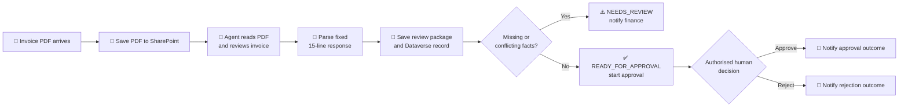

# Autonomous Invoice Orchestration Agent (GitHub Copilot Harness) - Overview

## Scenario Overview

| Property | Value |
|----------|-------|
| **Scenario Type** | Invoice orchestration |
| **Agent Type** | GitHub Copilot harness agent with enhanced orchestration |
| **Primary Tools** | Copilot Studio, Power Automate Workflows, Outlook, SharePoint, Dataverse and Approvals |
| **LLM** | GPT-5 Chat |
| **Complexity** | Intermediate |
| **Status** | ✅ Implemented and tested |

## Problem Statement

Many finance teams still receive invoices by email, manually inspect each PDF, re-enter its
details, record the review and decide whether it is ready for approval. Incomplete invoices,
conflicting totals and missing accounting codes create delays and increase the risk that an
unsupported request reaches an approver.

This scenario tests whether an agent built with the GitHub Copilot harness can read a saved
invoice PDF, produce a consistent evidence-based review and return a machine-readable routing
decision, while Power Automate retains control of storage, system writes, notifications and the
real human approval.

## Solution Summary

The solution uses one published **Invoice Orchestration Agent** and one main **Invoice Intake and
Approval Routing** workflow. The workflow receives an emailed PDF and saves it to SharePoint. It
then invokes the agent with the email context and exact SharePoint location.

The agent uses a read-only SharePoint tool and the `invoice-review` skill to extract invoice
fields, identify missing or conflicting facts and return an exact 15-line response. The workflow
parses that response, saves a review package to SharePoint, creates an **Auto Invoice Reviews**
Dataverse record and branches on the result:

- `NEEDS_REVIEW` sends an issue notification and does not request approval.
- `READY_FOR_APPROVAL` starts a real Approvals request and notifies the submitter of the
  authorised human decision.

The agent never approves, rejects or pays an invoice and has no write access to the business
systems used by the workflow.

## How the GitHub Copilot Harness Enhances the Scenario

| Enhancement | Value |
|-------------|-------|
| 🛠️ **Conversational creation** | The working agent and workflow were created and refined from a natural-language description, reducing manual blank-canvas configuration. |
| 🧠 **Agent-based document review** | The agent reads the saved PDF, extracts the required facts and reasons over completeness and internal consistency. |
| 🧩 **Reusable review skill** | The focused `invoice-review` skill makes the review procedure visible, reusable and easier to audit independently of the main instructions. |
| 🔀 **Structured orchestration handoff** | The agent returns a fixed 15-line contract, including `READY_FOR_APPROVAL` or `NEEDS_REVIEW`, which the workflow parses deterministically. |
| 🛡️ **Separation of reasoning and authority** | The agent reviews evidence; Power Automate performs writes and routing; an authorised person makes the approval decision. |
| 🔍 **Explainable exceptions** | Missing or conflicting facts are returned explicitly and included in the finance notification and stored review package. |

The harness improves both **authoring productivity** and the **runtime review step**. Faster
construction alone is not the business control: the runtime value comes from the agent's
evidence-based review and structured handoff to a deterministic workflow.

## How It Works

The `READY_FOR_APPROVAL` value means only that the invoice passed the configured completeness
and consistency review. It is not financial approval. A human decision through Approvals remains
mandatory.

## Business Outcomes - Invoice Orchestration Agent

| Outcome | Description |
|---------|-------------|
| ✅ Reduced manual invoice review | Extracts and checks common invoice fields before finance intervention. |
| ⚡ Faster exception routing | Incomplete or conflicting invoices are separated from approval-ready invoices immediately. |
| 🤖 Intelligent document interpretation | Handles invoice content rather than relying on one rigid document layout. |
| 📄 Consistent review package | Produces a fixed set of invoice facts, issues and a human-readable summary. |
| 👤 Human-in-the-loop control | Only an authorised person can approve or reject the payment request. |
| 🔗 End-to-end traceability | Preserves the source PDF, review package, Dataverse record and workflow outcome. |
| 📊 Structured operational data | Records the invoice key, decision and review details for reporting and audit. |
| 🛡️ Guardrailed automation | Keeps agent access read-only and system writes inside the workflow. |

## Target Users

| User Group | Description |
|------------|-------------|
| 📩 **Invoice submitters / vendors** | Send invoice PDFs to the designated mailbox. |
| 💰 **Accounts Payable / finance staff** | Review issue notifications and resolve missing or conflicting information. |
| 👩‍💼 **Authorised approvers** | Approve or reject requests that pass the automated review. |
| 🛠️ **Power Platform engineers** | Configure and support the agent, workflow, connections and data stores. |
| 📊 **Finance operations / reporting teams** | Use Dataverse records and workflow history for tracking and audit. |
| 🧪 **Solution owners** | Validate the controls, test cases and readiness for wider deployment. |

### ✅ In Scope

- Receive digital PDF invoice attachments through an agreed Outlook mailbox.
- Save source PDFs and generated review packages to SharePoint.
- Read the exact saved PDF through a scoped, read-only SharePoint agent tool.
- Extract vendor, invoice, date, currency, amount, PO, GL code and billed-to information.
- Identify configured missing fields and verifiable internal conflicts.
- Return the exact 15-line agent response expected by the workflow.
- Store the review result in the **Auto Invoice Reviews** Dataverse table.
- Route `NEEDS_REVIEW` cases to finance by email.
- Route `READY_FOR_APPROVAL` cases to a real human Approvals request.
- Notify the agreed recipient of the recorded approval or rejection outcome.

### ❌ Out of Scope

- Allowing the agent to approve, reject or pay an invoice.
- ERP posting, payment execution or bank-detail changes.
- Guessing vendor IDs, purchase orders, GL codes or other missing values.
- Treating `READY_FOR_APPROVAL` as an approval decision.
- Generic mailbox, SharePoint or Dataverse write access for the agent.
- Credit notes, statements, expense claims or non-invoice document families.
- Production SLA, enterprise monitoring, disaster recovery or unattended scale claims.
- Assuming scanned, handwritten, password-protected or unsupported PDFs work without testing.

## Implementation Evidence

| Path | Evidence |
|------|----------|
| ⚠️ **Needs review** | User-reported successful: source saved, agent called, response parsed, review saved, Dataverse record created and issue notification sent; approval actions skipped. |
| ✅ **Ready and approved** | Verified on 24 September 2026: issue branch skipped, Approvals request completed, approved branch taken and approval outcome notification sent. |
| ❌ **Ready and rejected** | Configured in the workflow but requires a separately recorded rejection test before claiming validated behaviour. |

## Related Resources

| Resource | Link |
|----------|------|
| **Architecture** | [2.Architecture.md](2.Architecture.md) |
| **Step-by-Step Runbook** | [3.Runbook.md](3.Runbook.md) |
| **Sample Prompts and Tests** | [4.Sample-prompts.md](4.Sample-prompts.md) |
| **Resources and Delivery Status** | [0.Resources/README.md](0.Resources/README.md) |
| **Original Standard Scenario** | [../Autonomous-Invoice-Orchestration-Agent/1.Overview.md](../Autonomous-Invoice-Orchestration-Agent/1.Overview.md) |
