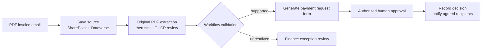

# Autonomous Invoice Orchestration Agent (GHCP) - Overview

## Scenario Overview

| Property | Value |
|---|---|
| **Scenario Type** | Invoice Orchestration |
| **Agent Type** | Copilot Studio agent powered by the GitHub Copilot harness, working with an invoice intake and approval workflow |
| **Primary Tools** | Copilot Studio, Power Automate, Outlook, SharePoint, Dataverse and approved finance references |
| **LLM** | An approved model available in the target GHCP environment |
| **Complexity** | Intermediate |
| **Status** | [Delivery status and supplied resources](0.Resources/README.md#delivery-status) |

Similar to the [standard-harness version](../Autonomous-Invoice-Orchestration-Agent/1.Overview.md),
this agent supports the process from an emailed PDF invoice to a payment request form and
human approval. SharePoint holds the documents; Dataverse holds the transaction and its status.

The original workflows still save the PDF, extract its details, create the form and obtain
approval. The small GHCP addition is an invoice-review skill: check the extracted information
and accounting-reference findings, and explain missing or conflicting facts.
Workflows enforce financial checks and writes; an authorized person makes the approval decision.

## Problem Statement

Finance teams often receive invoices by email, copy the details into payment request forms,
look up accounting codes and chase the correct approver. Re-entering the same information takes
time and introduces errors. Missing purchase-order references, conflicting totals or an incorrect
cost centre create further delays.

The team needs a consistent way to collect the invoice, check its supporting information and
prepare a traceable request for approval, without letting an unsupported AI answer become a
financial decision.

## Solution Summary

The Invoice Orchestrator coordinates invoice intake, document storage, extraction, payment form
generation and manager approval. It presents source-backed invoice details and highlights
exceptions before the request moves forward.

### How the GitHub Copilot Harness Adds Value

| Part of the scenario | GHCP enhancement |
|---|---|
| **Review the extraction** | Check the information returned by the original PDF-extraction flow. |
| **Check accounting details** | Review the original workflow's reference findings; do not invent a code. |
| **Handle an exception** | Explain missing or conflicting facts before form creation and approval. |
| **Reuse the review** | Put this small procedure in one Markdown skill. |

The [runbook](3.Runbook.md#1-create-the-ghcp-agent) links the [one skill](Skills/invoice-review/SKILL.md)
and [agent instructions](0.Resources/Agent-instructions.txt). Their PDF-flow bindings still need
implementation and validation. The older two-skill text pilot is in the
[archive](0.Resources/Archive/README.txt), not the default build path.

Standard agents also support knowledge and tools. The benefit here is the use of
[enhanced orchestration](https://learn.microsoft.com/en-us/microsoft-copilot-studio/agents-experience/overview)
and [reusable skills](https://learn.microsoft.com/en-us/microsoft-copilot-studio/agents-experience/skills-add-existing)
to investigate an invoice, not the harness change alone.

## How It Works

A PDF invoice arrives in the designated mailbox. Intake saves it to SharePoint and creates the
Dataverse transaction. The original parsing flow extracts invoice details. The GHCP agent reviews
that output before requesting the payment form.

The form workflow validates the amounts, accounting references and duplicate/version controls.
A supported request becomes a pre-filled payment request form for human review. Missing or
conflicting information becomes an exception for the responsible finance user.

The separately configured approval workflow routes the reviewed request to the authorized
manager, records the decision and sends the agreed status notifications. The accounts team
retains responsibility for any subsequent payment processing.

This is the simplified scenario design, not a completed PDF deployment.
The [delivery status](0.Resources/README.md#delivery-status) distinguishes it from the
existing text-based implementation. No new extraction engine or custom rendering framework is
required just to add GHCP.

## Business Outcomes - Invoice Orchestration Agent

| Outcome | Description |
|---|---|
| **Reduced manual invoice processing effort** | Less re-entry of invoice data and repeated reference checking. |
| **Faster invoice-to-approval cycle** | A consistent path from receipt to a reviewable payment request. |
| **Evidence-backed data extraction** | Reviewers can trace extracted values to the invoice and supporting records. |
| **Payment form preparation** | Pre-filled requests with visible validation findings and unresolved items. |
| **Human-in-the-loop control** | Authorized managers retain approval responsibility. |
| **End-to-end traceability** | Source files, forms and actual decisions remain linked to the transaction. |
| **Centralized data management** | Dataverse holds structured invoice information and processing status. |
| **Consistent workflow execution** | Permissions, financial rules and duplicate handling are enforced outside the model. |

Measure these intended benefits against the team's existing handling time, correction rate and
exception workload; no measured savings are claimed by the supplied examples.

## Target Users

| User Group | Description |
|---|---|
| **Invoice submitters** | Employees or vendors who send the invoice and supporting information. |
| **Managers / approvers** | Review the request and approve or reject within their financial authority. |
| **Accounts payable / finance team** | Resolve exceptions and handle approved requests through existing payment processes. |
| **System administrators / delivery engineers** | Configure the agent, workflows, storage and access controls. |
| **Finance operations / reporting team** | Use transaction data and actual approval history for tracking and reporting. |
| **Solution owners** | Agree scope, review results and decide readiness for wider use. |

### In Scope

- Digital PDF invoice intake, original-file storage and linked Dataverse records.
- Source-linked extraction of invoice fields, with missing or conflicting facts made visible.
- The original agreed accounting-reference and financial checks.
- Pre-filled HTML payment request forms following the original form-creation approach.
- Human approval, recorded decisions and agreed notifications through controlled workflows.
- Explicit exception handling, duplicate protection and recovery of uncertain writes.

The formats, enabled operations and implementation coverage are listed in
[Resources](0.Resources/README.md). A generated form is not an approval or a payment.

### Out of Scope

- ERP posting, payment execution or bank-detail changes.
- Expense claims, credit notes, statements and other non-invoice document families.
- Unrestricted mailbox searches or generic file/table write access for the agent.
- Portal development, custom UI projects, production SLA guarantees or an assumption that all
  PDF, scanned or handwritten invoices are supported.

## Related Resources

| Resource | Link |
|---|---|
| Architecture | [2.Architecture.md](2.Architecture.md) |
| Step-by-Step Runbook | [3.Runbook.md](3.Runbook.md) |
| Sample Prompts | [4.Sample-prompts.md](4.Sample-prompts.md) |
| Resources and Delivery Status | [Resources](0.Resources/README.md#delivery-status) |
| Standard-Harness Scenario | [Autonomous Invoice Orchestration Agent](../Autonomous-Invoice-Orchestration-Agent/1.Overview.md) |
| Copilot Studio Documentation | [GitHub Copilot harness overview](https://learn.microsoft.com/en-us/microsoft-copilot-studio/agents-experience/overview) |
