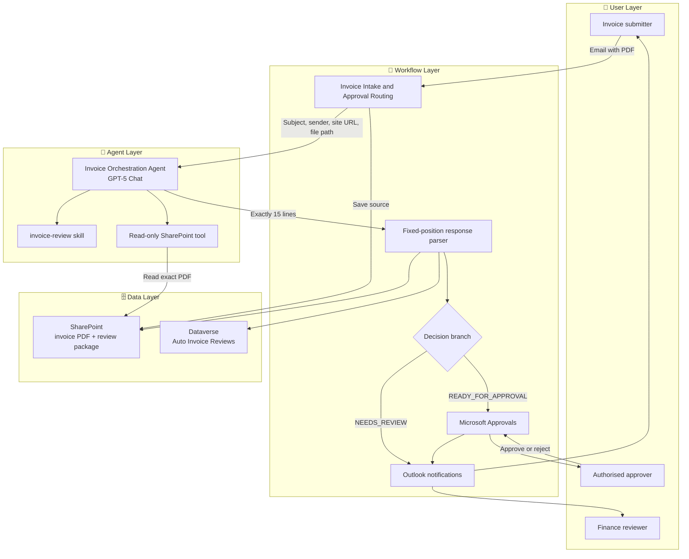
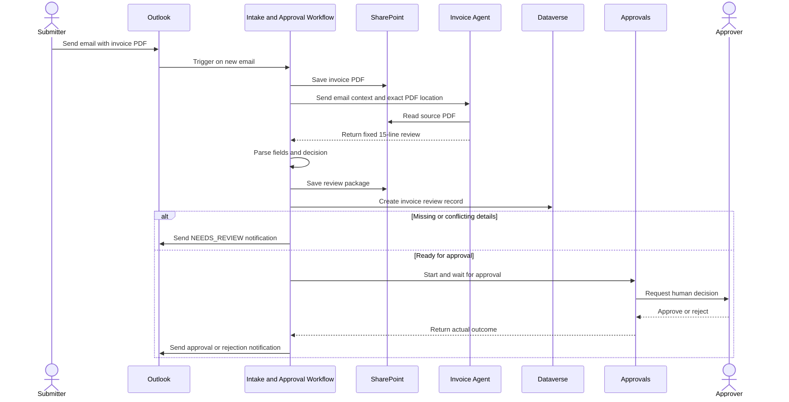

# Autonomous Invoice Orchestration Agent (GitHub Copilot Harness) - Architecture

## 1. Logical Architecture

The solution separates **invoice intake and controlled actions** from **document interpretation
and review**:

1. **User layer** - a submitter emails an invoice and an authorised approver responds through
   Microsoft Approvals.
2. **Workflow layer** - Power Automate controls intake, storage, parsing, records,
   notifications and approval routing.
3. **Agent layer** - the GitHub Copilot harness agent reads one specified SharePoint PDF and
   returns a structured review.
4. **Data layer** - SharePoint stores documents and Dataverse stores review records.

### High-Level Architecture



No separate Knowledge source is required. The source of truth for each run is the PDF saved to
SharePoint and identified by the workflow.

---

## 2. Key Components

| Component | Technology | Role |
|-----------|------------|------|
| **Invoice Orchestration Agent** | Copilot Studio GitHub Copilot harness | Reads and reviews one specified invoice PDF. |
| **Agent model** | GPT-5 Chat | Extracts invoice facts and evaluates configured missing/conflicting conditions. |
| **Agent instructions** | Copilot Studio | Defines input context, fields, decision rules, fixed output contract and absolute prohibitions. |
| **Invoice review skill** | Markdown skill | Encapsulates the direct-PDF review procedure and reinforces the handoff boundary. |
| **SharePoint tool** | Read-only SharePoint connector | Allows the agent to read the exact PDF saved by the workflow. |
| **Invoice Intake and Approval Routing** | Power Automate Workflow | Owns email intake, storage, agent invocation, parsing, writes, branching, approval and notifications. |
| **Source and review storage** | SharePoint | Stores the original invoice and generated review package. |
| **Review record** | Dataverse - Auto Invoice Reviews | Stores structured review and processing metadata. |
| **Human decision** | Microsoft Approvals | Captures the authorised approve/reject decision. |
| **Notifications** | Outlook | Sends issue, approval and rejection notifications. |

### Why One Workflow

The working implementation uses one visible orchestration workflow rather than the original
scenario's chain of separate parser, form-generation and approval flows. This reduces handoffs
and makes branch execution visible in one run history. The agent remains independently
maintainable because the invoice review procedure is separated into a skill.

---

## 3. Agent Input and Output Contract

### Invocation Context

The workflow provides:

| Input | Purpose |
|-------|---------|
| **Email subject** | Identifies the intake context. |
| **Email sender** | Preserves submission context for the review and notifications. |
| **SharePoint site URL** | Scopes the read operation. |
| **SharePoint file path** | Identifies the exact PDF; the agent does not search for another invoice. |

### Fixed Response

The agent returns exactly 15 non-empty plain-text lines:

```text
INVOICE_KEY: <legal entity|vendor|invoice number>
DECISION: READY_FOR_APPROVAL or NEEDS_REVIEW
VENDOR_NAME: <value>
INVOICE_NUMBER: <value>
INVOICE_DATE: <value>
DUE_DATE: <value>
CURRENCY: <value>
SUBTOTAL: <value>
TAX: <value>
TOTAL_AMOUNT_DUE: <value>
PURCHASE_ORDER_NUMBER: <value>
ACCOUNTING_GL_CODE: <value>
BILLED_TO_LEGAL_ENTITY: <value>
ISSUES_FOUND: <None or semicolon-separated issues>
SUMMARY: <single-paragraph human review request>
```

Power Automate parses the response by fixed line position. Therefore additional headers,
Markdown, blank lines or multi-line field values are contract-breaking changes.

---

## 4. Data Flow



---

## 5. Decision Model

| Condition | Result |
|-----------|--------|
| Vendor, invoice number, invoice date, due date or total is missing | `NEEDS_REVIEW` |
| Required accounting/GL code is not printed on the invoice | `NEEDS_REVIEW` |
| Verifiable totals, dates or currency conflict | `NEEDS_REVIEW` |
| No configured missing or conflicting facts | `READY_FOR_APPROVAL` |
| Authorised person selects Approve | Workflow records and notifies approval |
| Authorised person selects Reject | Workflow records and notifies rejection |

`READY_FOR_APPROVAL` is a routing result, not approval.

---

## 6. Security and Governance Considerations

| Area | Consideration |
|------|---------------|
| 🔐 **Least privilege** | The agent has a read-only SharePoint tool and no Dataverse, email, approval or payment write tool. |
| 🎯 **Document scope** | The workflow supplies an exact site and path; the agent must not search for a different invoice. |
| 🧾 **Evidence boundary** | Values must come from the PDF. Missing values are reported, not inferred. |
| 💳 **Financial authority** | The agent cannot approve, reject, schedule or execute payment. |
| 🔀 **Deterministic routing** | Power Automate parses the fixed contract and controls all branching and side effects. |
| 👤 **Human oversight** | An authorised human makes the actual approval decision through Approvals. |
| 🔁 **Duplicate handling** | Production hardening should add or verify mailbox, invoice-key and source-version idempotency controls. |
| 📋 **Auditability** | Source PDF, review package, Dataverse record and workflow run history provide the evidence chain. |
| 🧠 **Knowledge boundary** | No Knowledge source is configured; the run is grounded in the exact SharePoint PDF. |

## Related Resources

| Resource | Link |
|----------|------|
| Scenario Overview | [1.Overview.md](1.Overview.md) |
| Step-by-Step Runbook | [3.Runbook.md](3.Runbook.md) |
| Sample Prompts and Tests | [4.Sample-prompts.md](4.Sample-prompts.md) |
| Agent Instructions | [0.Resources/Agent-instructions.txt](0.Resources/Agent-instructions.txt) |
| Invoice Review Skill | [Skills/invoice-review/SKILL.md](Skills/invoice-review/SKILL.md) |
