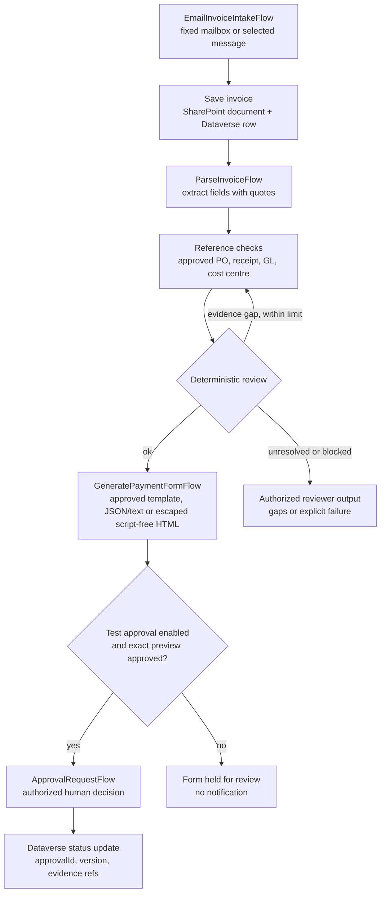

# Architecture - Finance Document Processing and Approval Agent (GHCP)

This is a lean adaptation, not a replacement engineering project. Keep the original process and add cited evidence plus safer decision gates.

## Process

The GHCP agent does not get direct broad access. It uses fixed workflows over approved resources. Authorization from authenticated transport is checked before mail content is read or saved; source headers and caller-supplied identity fields are not authority. `GetEmailV2` reads a message, not a full conversation. SharePoint content actions return file bytes, not automatic metadata/version proof. Denied content must never be copied to a review package.

Use at most two targeted follow-up reads to resolve a known gap, then produce
the form or exception. This is a proposed instruction/flow bound, not a harness
setting. Flow failures can occur at any step; only write an exception/status
record if authorized storage is available. Otherwise return the explicit failure.

## Minimal data state

A Dataverse row or equivalent approved table should track only what the original process needs:

- intake token or selected message id;
- canonical vendor plus invoice number and legal entity as the duplicate key;
- current status and reason;
- evidence references and generated form link;
- record version and optional approval id.

Amount and currency are checked values, not part of invoice identity. Guard the first intake write with a stable mailbox/item token, and guard package creation with vendor/invoice/entity identity once extracted. Use an atomic unique key or equivalent transaction, not an unprotected read-then-create check. If duplicate protection is unavailable, leave writes off. Reconcile a timeout against the known record; unresolved writes return `unknown_outcome`.

## Agent versus actual action

| Need | Agent label | Actual source/action |
|---|---|---|
| Read invoice message | `ReadInvoiceMessage` | Office 365 Outlook `GetEmailV2` or selected-message workflow, with Original Mailbox Address fixed by policy |
| Read attachment text | `ReadInvoiceAttachmentText` | Office 365 Outlook `GetAttachment_V2` plus approved text adapter |
| Check references | `LookupFinanceReference` | Dataverse `GetItem`/`ListRecords` over fixed approved vendor, PO, receipt, GL and cost-centre records |
| Validate and generate | `GeneratePaymentFormFlow` plus its deterministic validation step | Reuse the original flow design; SharePoint `CreateFile`; Dataverse `CreateRecord`/`UpdateOnlyRecord`. New labels do not require new services. |
| Verify package state | `ReadInvoiceStatus` | Scoped Dataverse `GetItem` or bounded `ListRecords`; read only, never restarts a workflow |
| Approval | `ApprovalRequestFlow`: explicitly separate start and decision-read operations | Approvals `CreateAnApproval` or `StartAndWaitForAnApproval` for start, `WaitForAnApproval` or recorded row for decision read. A read must never silently create an approval. |

These labels are contracts for a narrow implementation. They are not native operations and are not supplied here as exports.

## Evidence rules

The parse step returns exact quotes and source ids. Use page numbers only when a real adapter provides them; otherwise cite text segments. Conversation uploads are limited by Copilot Studio attachment behavior, but that does not prove connector byte limits, PDF conversion, OCR, page extraction or confidence scores. If readable evidence is missing, conflicting or unsupported, stop with `needs_review` or `unsupported_input`.

Approved GL and cost centres come from the original approved reference table, not from user text. PO and receipt checks are used when applicable; no-PO invoices may proceed only through an approved policy path. The payment request remains the original output: a deterministic approved template, structured text/JSON, or escaped script-free HTML. No new UI service is required.

## Approval

The approval workflow is controlled behavior, not a third skill. Create/start actions can notify people, so the integration starts off. Obtain approval of exact recipients/content, then use a dedicated test identity. Verify authorized principal, request ID, current record version and eligible state before mapping raw `Approve`/`Reject`. Successful reads use `ok` with separate `approval_state: approved` or `rejected`; `denied` means unauthorized. Cancellation/expiry are lifecycle states, not invented raw responses. Material changes invalidate the old decision. No state permits payment or posting.

An approval wait does not become asynchronous merely because a prompt says
"return pending". Implement a short start response with the request ID and
separate workflow-owned wait/state recording, or validate the supported wait
behavior in the target environment. Do not hold a model turn for a human decision.

Outlook uses a delegated mailbox connection, not service-principal authentication.
SharePoint/Dataverse connections need only approved library and table privileges.
Do not equate a sender's manager with authorized financial approval.

## Reused patterns

- [Document processing](../../02-patterns/Intelligent-Document-Processing-Pipeline/Intelligent-Document-Processing-Pipeline.md): source-linked extraction and deterministic checks.
- [Human review](../../02-patterns/Human-in-the-Loop-Review-and-Approval/Human-in-the-Loop-Review-and-Approval.md): evidence-backed decisions, separate from financial effects.
- [Governance](../../02-patterns/Agent-Governance-and-Rollout-Control-Plane/Agent-Governance-and-Rollout-Control-Plane.md): scoped connections and disabled consequential actions.

These are technical design references; skills contain the scenario procedures.

## References

- [GHCP agents overview](https://learn.microsoft.com/en-us/microsoft-copilot-studio/agents-experience/overview)
- [Add an existing skill](https://learn.microsoft.com/en-us/microsoft-copilot-studio/agents-experience/skills-add-existing)
- [Tools for agents](https://learn.microsoft.com/en-us/microsoft-copilot-studio/agents-experience/tools-available)
- [Office 365 Outlook](https://learn.microsoft.com/en-us/connectors/office365/)
- [SharePoint](https://learn.microsoft.com/en-us/connectors/sharepointonline/)
- [Dataverse](https://learn.microsoft.com/en-us/connectors/commondataserviceforapps/)
- [Approvals](https://learn.microsoft.com/en-us/connectors/approvals/)
