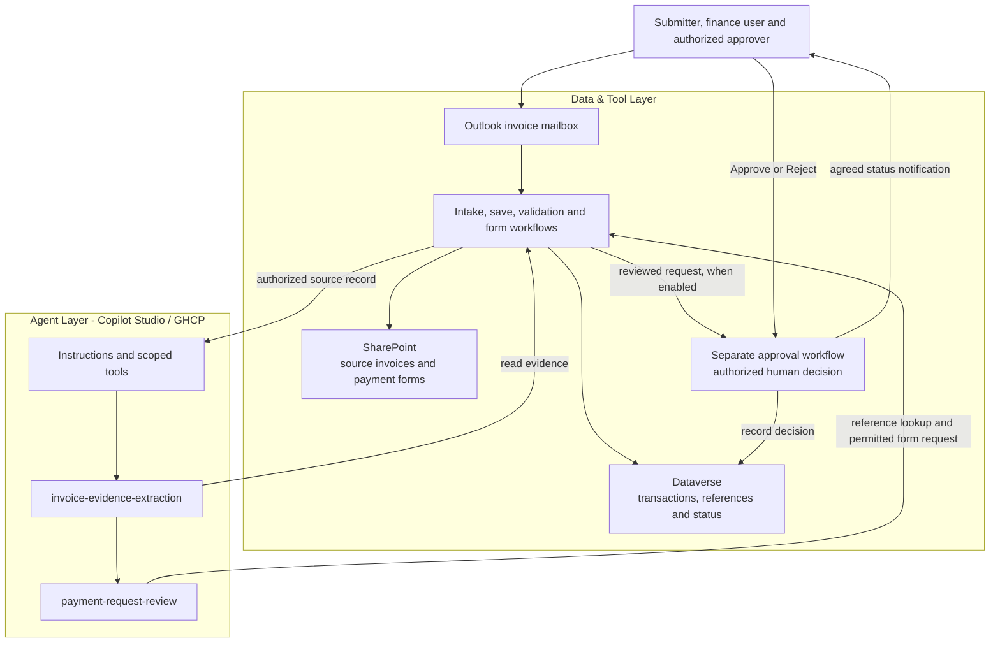

# Autonomous Invoice Orchestration Agent (GHCP) - Architecture

## 1. Logical Architecture

The solution has the same three layers as the
[standard-harness architecture](../Autonomous-Invoice-Orchestration-Agent/2.Architecture.md):
the **User Layer**, **Agent Layer** and **Data & Tool Layer**.

### How It Works

The diagram shows the intended design. See [delivery status](0.Resources/README.md#delivery-status)
for demonstrated components; skill attachment alone does not prove execution order.

### Environment Architecture

Copilot Studio hosts the agent and its two skills. Scoped workflows access the designated
mailbox, libraries and tables through approved connections. Intake/save and human approval
are workflow stages, not additional skills. The agent has no unrestricted data access.

## 2. Key Components

| Component | Technology | Role |
|---|---|---|
| **Agent environment** | Approved Power Platform environment | Hosts the GHCP agent, workflows and Dataverse data. |
| **Agent runtime** | Copilot Studio with GitHub Copilot harness | Investigates invoice evidence and selects permitted tools. |
| **Model / orchestrator** | Approved model | Interprets source text and prepares the review response. |
| **Instructions and skills** | Agent instructions and two Markdown skills | Define invoice scope, evidence rules and review procedure. |
| **Invoice intake and storage** | Outlook, Power Automate, SharePoint and Dataverse | Save the source and its transaction references. |
| **Finance references** | Scoped lookup of approved records | Supply vendor, PO, receipt, GL, cost-centre and no-PO guidance. |
| **Form generation** | Controlled workflow and template | Validate the request, prevent duplicates and save the form. |
| **Approval and status** | Human-approval workflow and Dataverse | Record the authorized decision and notify agreed recipients. |

Tool contracts and implementation differences are in the
[capability matrix](0.Resources/Capability-matrix.md).

## 3. Data Flow

### Email-triggered Invoice Approval Process

| Step | Original process stage | GHCP version |
|---|---|---|
| **1. Receive** | `EmailInvoiceIntakeFlow` | Detect the scoped invoice email and pass its actual message ID to intake. |
| **2. Save** | Save invoice flow | Claim the intake once, store the original attachment and create the source transaction. |
| **3. Extract** | `ParseInvoiceFlow` | Extract cited invoice fields; consult approved references to resolve a specific gap or conflict. |
| **4. Generate** | `GeneratePaymentFormFlow` | Independently validate amounts, references and source version; generate the permitted review form or an explicit exception. |
| **5. Approve** | `ApprovalRequestFlow` | Send the reviewed request to an authorized manager through the separately enabled approval workflow. |
| **6. Complete the handoff** | Record status and notify | Persist the actual decision and notify the agreed submitter/finance recipients. Payment remains outside this agent. |

SharePoint stores the invoice and form. Dataverse holds invoice identity, source/evidence
references, status, form URL, version and approval request ID. On missing evidence or a failed
step, retain completed work and identifiers; pending is not complete.

The supplied implementation uses operator-selected intake, a saved snapshot and a JSON review
file. Automatic arrival, reliable agent generation, HTML output and approval remain outstanding.

## 4. Security & Governance Considerations

| Area | Consideration |
|---|---|
| **Credentials** | Use approved delegated Outlook access and scoped storage connections. Email headers are not proof of authority. |
| **Data scope** | Fix the mailbox, libraries, tables and permitted records in the workflows. Check access before reading or saving content. |
| **Evidence** | Cite actual sources. Do not invent page numbers, OCR results or missing values. |
| **Financial validation** | Workflows enforce arithmetic and reference rules. Model calculations are proposals until those checks complete. |
| **Duplicate protection** | Claim intake by mailbox/item identity and forms by vendor/invoice/legal-entity identity before writes. |
| **Human approval** | Verify the approver, request ID, current version and actual decision. A sender's manager is not automatically an authorized financial approver. |
| **Changed or uncertain state** | Material edits invalidate approval. Reconcile possible writes before retrying; retain partial file and row references. |
| **Notifications and financial effects** | Enable exact recipients/content through the agreed approval process. No posting, payment or bank-detail changes. |

[Workflow controls](0.Resources/README.md#workflow-controls) cover implementation, approval
waits and failure handling; their current coverage is recorded separately.

## Related Resources

| Resource | Link |
|---|---|
| Scenario Overview | [1.Overview.md](1.Overview.md) |
| Step-by-Step Runbook | [3.Runbook.md](3.Runbook.md) |
| Sample Prompts | [4.Sample-prompts.md](4.Sample-prompts.md) |
| Capability Matrix | [Capability matrix](0.Resources/Capability-matrix.md) |
| Delivery Status and Technical References | [Resources](0.Resources/README.md) |
| Document Processing Pattern | [Intelligent Document Processing](../../02-patterns/Intelligent-Document-Processing-Pipeline/Intelligent-Document-Processing-Pipeline.md) |
| Human Approval Pattern | [Human-in-the-Loop Review and Approval](../../02-patterns/Human-in-the-Loop-Review-and-Approval/Human-in-the-Loop-Review-and-Approval.md) |
