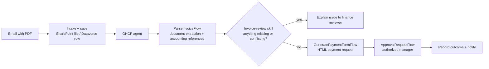

# Autonomous Invoice Orchestration Agent (GHCP) - Architecture

## 1. Logical Architecture

The architecture follows the [original scenario](../Autonomous-Invoice-Orchestration-Agent/2.Architecture.md).
Keep the invoice workflows and storage; use a GHCP agent with one small review skill.

### How It Works

This is the simplified target. The existing tested text-snapshot implementation is separate;
see [delivery status](0.Resources/README.md#delivery-status).

### Environment Architecture

Outlook receives the invoice. SharePoint stores the PDF and payment form. Dataverse holds the
transaction and status. Copilot Studio hosts the agent; the supporting workflows own storage,
financial checks, approval and notifications. No new service or database is required solely
because the agent uses GHCP.

## 2. Key Components

| Component | Keep or change? |
|---|---|
| Invoice intake and saving flows | Keep the original PDF/file/transaction process. |
| ParseInvoiceFlow | Keep document extraction and the agreed accounting-reference lookup. |
| Copilot Studio agent | Create a GHCP version with the existing process instructions. |
| Invoice-review skill | Small addition: check extracted information and explain exceptions. |
| GeneratePaymentFormFlow | Keep the original HTML-form creation approach. |
| ApprovalRequestFlow | Keep the authorized human decision and notification process. |

The [runbook](3.Runbook.md) links the [instructions](0.Resources/Agent-instructions.txt) and
[single skill file](Skills/invoice-review/SKILL.md). The original flow contracts still need
confirmation in the target environment. Old snapshot-specific files and JSON are in
[Archive](0.Resources/Archive/README.txt), not the build checklist.

## 3. Data Flow

1. Intake receives a PDF, saves it and passes its Dataverse RowId.
2. The agent requests extraction for that transaction, not a broad mailbox search.
3. The review skill checks the returned information and agreed reference findings.
4. A supported request goes through the form workflow; unresolved facts stop for review.
5. The separate approval workflow records the manager's decision and agreed notifications.

Source and record identifiers remain workflow-owned values. Do not ask the model to invent or
shorten them. Keep the original transaction identity through the handoff; do not introduce a
new per-document deployment step.

## 4. Security & Governance Considerations

| Boundary | Required behavior |
|---|---|
| Access | Use approved mailbox/library/table connections and enforce scope in the workflows. |
| Invoice evidence | Preserve the original PDF; do not invent missing facts or source references. |
| Financial checks | Existing workflow rules determine eligibility; the model's opinion is not validation. |
| Duplicate/failure handling | Preserve working controls and reconcile uncertain writes before retrying. |
| Approval | Record a real authorized decision for the reviewed version; changes require renewed review. |
| Financial effects | No posting, payment or bank-detail changes. |

Simplifying the teaching path does not remove these controls or imply production certification.

## Related Resources

| Resource | Link |
|---|---|
| Scenario Overview | [1.Overview.md](1.Overview.md) |
| Step-by-Step Runbook | [3.Runbook.md](3.Runbook.md) |
| Sample Prompts | [4.Sample-prompts.md](4.Sample-prompts.md) |
| Supplied Assets and Actual Coverage | [Resources](0.Resources/README.md#delivery-status) |
| Original Architecture | [Standard-harness architecture](../Autonomous-Invoice-Orchestration-Agent/2.Architecture.md) |
