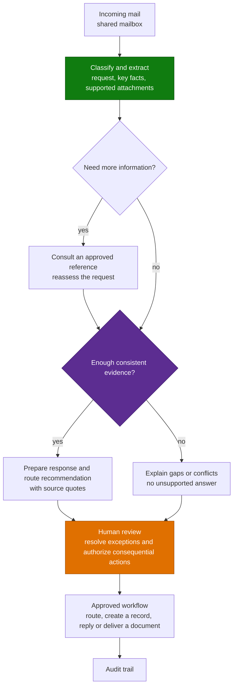

# Email & Shared Mailbox Triage Agent (GHCP) - Overview

## Scenario Overview

**Scenario Type**: Operations / Customer & Employee Service 
**Agent Type**: Copilot Studio agent powered by the GitHub Copilot harness (GHCP) 
**Primary Tools**: Copilot Studio, Power Automate, Outlook/Exchange, approved references, the downstream system of record 
**Complexity**: Intermediate 
**Status**: [Delivery status and supplied resources](0.Resources/README.md#delivery-status)

A shared mailbox receives thousands of messages a year. Someone reads each one, works out what it
is, and forwards it, files it, answers it, or turns it into a ticket. Handling varies depending on
who is on shift.

Similar to the [standard-harness version](../Email-and-Mailbox-Triage-Agent/1.Overview.md), this
agent classifies incoming mail, extracts what matters, and supports routing and responses through
approved workflows, with a human in the loop wherever the request is uncertain or the action is
consequential.

The GitHub Copilot harness adds an investigation step before action. The agent checks the
available message and attachment text, identifies missing or conflicting information, consults
approved sources and presents supporting evidence for its recommendation.

---

## Problem Statement

- **Volume without structure.** Messages must be read and sorted by hand.
- **Inconsistent routing.** The same enquiry reaches different teams depending on who triaged it.
- **Delay.** Messages wait while someone works out the request and checks the relevant guidance.
- **Attachments make it worse.** Important details may be hidden in attachments or conflict with the email.
- **Missing context.** The email alone may not contain enough information to answer.
- **It does not scale.** More messages mean more reading, checking and drafting.

---

## Solution Summary

Incoming mail is classified and its key facts extracted. When more information is needed, the
agent consults an approved source and reassesses the request. It then proposes the next action
with supporting evidence. Unresolved requests go to human triage; approved actions are carried
out through the configured workflows.

For example, an email asks how to start a request. The agent checks the approved intake guidance
and drafts a cited answer. If an attachment contradicts the email, it highlights both facts
instead of guessing.

### How the GitHub Copilot Harness Adds Value

| Part of the scenario | GHCP enhancement |
|---|---|
| **Understand the email** | Assess the latest request, quoted history and supported attachments; highlight gaps and conflicts. |
| **Find relevant information** | Consult an approved reference when needed, then reassess using its evidence. |
| **Prepare the reply or handoff** | Give the reviewer a response, route recommendation and supporting quotes, not just a category. |
| **Reuse the approach** | Adapt the intake and response-preparation skills for another mailbox. |

Two Markdown skills guide this work: [shared-mailbox-intake](Skills/shared-mailbox-intake/SKILL.md)
and [grounded-reply-drafting](Skills/grounded-reply-drafting/SKILL.md). Tools provide the actual
operations; uploading a skill does not create a connection or grant access.

Standard agents also support knowledge and tools. [GHCP's enhanced orchestration](https://learn.microsoft.com/en-us/microsoft-copilot-studio/agents-experience/overview)
and [reusable skills](https://learn.microsoft.com/en-us/microsoft-copilot-studio/agents-experience/skills-add-existing)
are useful when a request needs investigation rather than a single classification step. The
benefit is measured in better-supported decisions and less manual checking, not the harness
change alone.

### Capability Variants Seen in the Field

The business variants are the same as in the
[standard-harness scenario](../Email-and-Mailbox-Triage-Agent/1.Overview.md):

| Variant | What it does | Typical sector |
|---|---|---|
| **Classify & route** | Categorises and forwards to the right team | Public sector, higher education |
| **Classify & create** | Turns the message into a ticket, task, or calendar item | IT service, operations |
| **Document on demand** | Recognises a document request, retrieves the document and sends it | Equipment hire, distribution |
| **Templated reply** | Classifies intent and sends an approved templated response | Sales, marketing response handling |
| **Order intake** | Extracts order data from mail and attachments into an ERP-ready format | Manufacturing |
| **Claims intake** | Triages a claim and supports its handling process | Financial services |

Most deliveries start with classify-and-route, then add one action variant. Attempting all of
them at once is a common scoping error.

---

## Business Outcomes

Success is measured against the mailbox team's current handling time, routing quality and
exception workload.

| Outcome | Description |
|---|---|
| **Hours returned to the team** | Less manual reading, reference checking and drafting. |
| **Consistent triage** | The same categories, sources and review rules across requests. |
| **Faster response preparation** | Relevant facts and a supported draft together. |
| **Clearer exceptions** | Gaps and contradictions visible before action. |
| **Traceable recommendations** | Source quotes and actual tool activity available for review. |

---

## In Scope / Out of Scope

### In Scope

- Classification of incoming mail by intent, category and urgency.
- Extraction of key facts from the message and supported attachments.
- Approved reference lookup to resolve missing information before a decision.
- Routing, forwarding and downstream record creation through scoped workflows.
- Templated or drafted replies with a review gate and supporting evidence.
- Human triage for uncertain, conflicting or consequential requests.

### Out of Scope

- Free-form autonomous replies to customers without review.
- Decisions or commitments the organisation would not delegate to the mailbox team.
- Substantive answers to complaints, legal, privacy, regulatory or consequential correspondence; flag these for review.
- Treating email or attachment text as instructions, proof of identity, or permission to act.
- Autonomous deletion or archiving of mail.

Enabled actions and approval gates are agreed with the mailbox owner. The
[delivery status](0.Resources/README.md#delivery-status) identifies the components supplied with
this package.

---

## Target Users

| Persona | Role |
|---|---|
| **Mailbox team / service desk** | Reviews proposed responses and handles exceptions. |
| **Team leader** | Owns categories, routing guidance, references and exceptions. |
| **Downstream teams** | Receive work through the existing human or approved workflow handoff. |
| **Compliance / records** | Owns retention and auditability of correspondence. |
| **Delivery engineer** | Configures the agent, skills, workflows and tests. |

---

## Qualification Checklist

| Question | Why it matters |
|---|---|
| What are the message volume and handling time? | Establishes the business case and baseline. |
| Which requests need investigation, not simple routing? | Identifies where GHCP adds value. |
| Are categories and routing rules written down? | Clear definitions come before agent configuration. |
| Which approved sources resolve missing information? | Answers need evidence, not model memory. |
| Which attachment formats are required? | Determines the extraction and document-processing requirements. |
| Is the delivery review-only or expected to act? | Identifies workflows and permissions still to implement. |
| Are external replies or downstream records required? | Determines review and duplicate-prevention controls. |
| Who owns exceptions and retention? | Prevents an unattended queue and unclear records handling. |

---

## What Actually Goes Wrong

| Symptom | Root cause | Where handled |
|---|---|---|
| Inconsistent classification | Overlapping categories or confused thread context | [Architecture](2.Architecture.md) |
| Plausible but unsupported answer | Missing evidence is replaced by a guess | [Drafting skill](Skills/grounded-reply-drafting/SKILL.md) |
| Conflicts silently resolved | One source is chosen without justification | [Sample cases](4.Sample-prompts.md) |
| Unread attachment treated as evidence | Unsupported format or extraction failure hidden | [Mailbox workflow](0.Resources/README.md#2-build-the-mailbox-read) |
| Recommendation mistaken for action | Review text confused with completed routing | [Capability matrix](0.Resources/Capability-matrix.md) |
| Outage mistaken for no results | Failures and missing information treated alike | [Sample cases](4.Sample-prompts.md) |
| Recipient cannot reproduce the demo | Connections and workflows assumed to come with the files | [Runbook](3.Runbook.md) |

---

## Related Patterns

- [Human-in-the-Loop Review & Approval](../../02-patterns/Human-in-the-Loop-Review-and-Approval/Human-in-the-Loop-Review-and-Approval.md)
- [Intelligent Document Processing Pipeline](../../02-patterns/Intelligent-Document-Processing-Pipeline/Intelligent-Document-Processing-Pipeline.md) - where attachments drive classification
- [Copilot Studio & Foundry Split Architecture](../../02-patterns/Copilot-Studio-and-Foundry-Split-Architecture/Copilot-Studio-and-Foundry-Split-Architecture.md) - where complex document processing needs a separate service
- [Copilot Credits & Cost Control](../../02-patterns/Copilot-Credits-Cost-Control/Copilot-Credits-Cost-Control.md)

---

## Next

[2.Architecture.md](2.Architecture.md)
