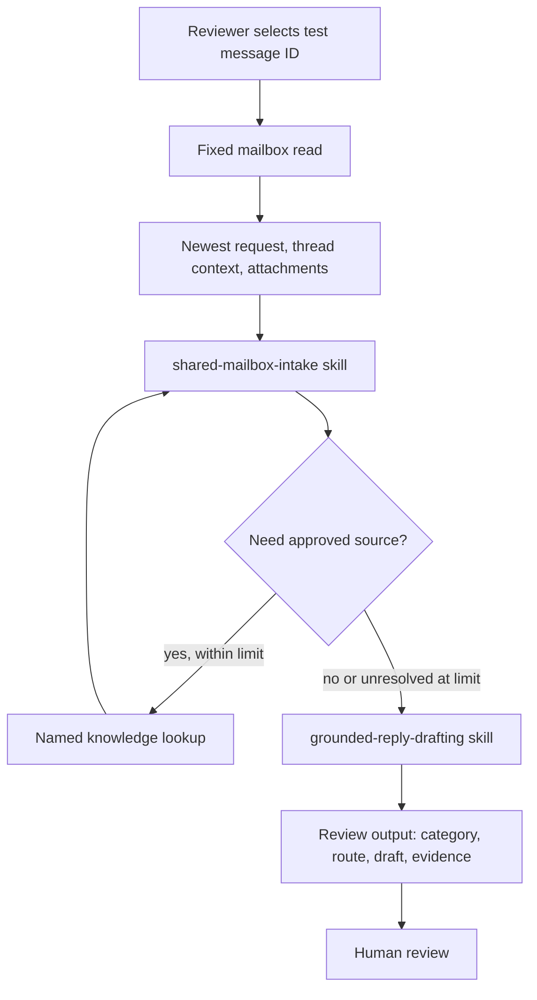

# Shared Inbox and Request Processing Agent (GHCP) - Architecture

> Status: Mailbox/text-attachment and fixed-reference workflows tested; effective denial remains unproven.

## Minimal architecture

Validation uses native Preview and workflow history. The pilot uses a literal-mailbox workflow accepting only message ID, not model-supplied mailbox selection.

Skills guide reasoning, not guaranteed sequential execution. The main instructions
and flow contracts enforce prerequisites. Limit follow-up to two relevant source
reads, then return the answer or unresolved gaps for review. This is a proposed
instruction/flow limit, not a native harness switch.

## Categories

| Category | Definition | Default output |
|---|---|---|
| `document-copy-request` | Sender asks for a copy of a named document. | Review package. Entitlement and delivery are not automated. |
| `status-enquiry` | Sender asks for progress, timing, or next step on an existing request. | Draft only if an approved status source states the status. |
| `policy-process-question` | Sender asks how a process works or what information is needed. | Answer only from approved named knowledge. |
| `unclear` | Multiple intents, missing material facts, unsupported input, conflict, or consequential content. | Human review, normally no substantive draft. |

## Tool mapping

| Agent tool label | Actual operation candidate | Boundary |
|---|---|---|
| `ReadSharedMailboxMessage` | Office 365 Outlook Get email (V2), operation `GetEmailV2`, fixed `OriginalMailboxAddress` where supported. | Authenticated principal must be authorized before content is returned. `GetEmailV2` returns the selected message and quoted content, not the whole thread. |
| `ReadSharedMailboxAttachmentText` | Pilot extraction is included in `ReadSharedMailboxMessage`: GetEmailV2 attachments plus Select/base64ToString. Separate GetAttachment_V2 remains an alternative. | Up to five non-inline .txt files <=64KB, text/plain or application/octet-stream; others unsupported. Decoder failure stays failed. No PDF/OCR. |
| Approved reference lookup | Pilot `LookupApprovedReference` reads three approved synthetic entries in a deterministic workflow. Production may use native knowledge or fixed SharePoint reads. | Test catalogue is not live company policy. Unknown keys return not_found; failures remain distinct. No arbitrary URLs. |
| Review response | Ordinary agent response in Preview, not a tool named `CreateReviewOutput`. | No mandatory custom audit database. Flow run history plus trace is baseline evidence, subject to approved retention/access. |
| `CreateTestTaskRecord` | Optional Dataverse Add a new row. | Disabled unless separately approved with idempotent persistent duplicate guard and readback. |
| `CreateSharedMailboxDraft` | Optional Graph POST `/users/{mailbox}/messages`. | New draft, not threaded reply. Requires broader Mail.ReadWrite.Shared and underlying shared rights, so do not build now. |

Generic HTTP/send actions are absent. Sending, forwarding, delete, archive, move, mark read/unread, and document delivery are not attached.

## Controls

- Connector delegated identity is distinct from the sender and from the reviewer.
- Backend policy rechecks authorization on each action, even if no skill activates.
- Source text is evidence, not instruction or authentication.
- `denied`, `unavailable`, `unsupported_input`, and `failed` stay distinct from `needs_review`.
- Optional writes need approval, idempotency, timeout reconciliation, and readback before enablement.
- A repeated manual read-only selected-item review can re-render a proposal; no durable intake ledger is required for that baseline.
- No profile lookup is needed. Use authenticated transport context and configured
  connection identity, never inferred identity or cached authorization.
- Disabling tools also blocks alternate paths/stale sessions; it does not cancel
  already accepted backend work or require revoking shared reads still in use.

## Reuse patterns

Use these existing technical patterns as references, not new scenario skills:

- [Document processing](../../02-patterns/Intelligent-Document-Processing-Pipeline/Intelligent-Document-Processing-Pipeline.md) for attachment provenance and unsupported-input handling.
- [Human review](../../02-patterns/Human-in-the-Loop-Review-and-Approval/Human-in-the-Loop-Review-and-Approval.md) for separating recommendation from consequence.
- [Governance](../../02-patterns/Agent-Governance-and-Rollout-Control-Plane/Agent-Governance-and-Rollout-Control-Plane.md) for least privilege, environment scope, and disablement.

## Additional references

- https://learn.microsoft.com/en-us/connectors/sharepointonline/
- https://learn.microsoft.com/en-us/connectors/commondataserviceforapps/
- https://learn.microsoft.com/en-us/graph/api/user-post-messages

Next: [Runbook](3.Runbook.md).
