# Architecture - Email & Shared Mailbox Triage Agent (GHCP)

> **Platform**: Copilot Studio with GitHub Copilot harness, Power Automate, Exchange Online, downstream system of record 
> **Last Updated**: September 2026 
> **Supplied components and evidence**: [Resources](0.Resources/README.md#delivery-status)

---

## Solution Architecture

Similar to the standard-harness version, a workflow receives mail, prepares the content and
controls the business action. The GHCP agent adds evidence gathering between classification
and the action decision.

```mermaid
flowchart LR
    MBX[("Shared mailbox<br/>Exchange Online")]
    subgraph INTAKE["Trigger and pre-processing"]
        PA["Mail-arrival workflow"]
        NORM["Filter noise<br/>isolate newest request"]
        ATT["Supported attachment text"]
    end
    subgraph AGENT["Copilot Studio - GitHub Copilot harness"]
        CLS["Classify and extract"]
        REF["Consult approved sources<br/>resolve gaps or expose conflicts"]
        REVIEW["Prepare recommendation<br/>response text and evidence"]
    end
    GATE{"Evidence and action gate"}
    HUMAN["Human triage and review"]
    ACTION["Approved workflow<br/>route, create record, reply or deliver"]
    SOR[("Downstream system")]
    LOG[("Execution and review history")]

    MBX --> PA --> NORM --> ATT
    ATT -->|Workflow Agent step| CLS
    CLS --> REF --> REVIEW --> GATE
    GATE -->|uncertain or review required| HUMAN
    GATE -->|approved low-consequence route| ACTION
    HUMAN -->|approved| ACTION
    ACTION --> SOR
    ACTION --> LOG
    HUMAN --> LOG

    style CLS fill:#107c10,color:#fff,stroke:#0a5c0a
    style GATE fill:#5c2d91,color:#fff,stroke:#3b1a6b
    style HUMAN fill:#e07000,color:#fff,stroke:#a05000
```

The intake workflow calls the published GHCP agent through the native **Agent** step and uses
its result in later steps. See [connection setup](0.Resources/README.md#connect-the-published-agent).
The diagram describes the delivery architecture; [delivery status](0.Resources/README.md#delivery-status)
distinguishes the demonstrated connection from the complete intake-to-action process.

### Skills and Tools

| Component | Responsibility |
|---|---|
| [shared-mailbox-intake](Skills/shared-mailbox-intake/SKILL.md) | Assess one request, classify intent and identify missing or conflicting facts. |
| [grounded-reply-drafting](Skills/grounded-reply-drafting/SKILL.md) | Prepare a source-backed response and route recommendation for review. |
| `ReadSharedMailboxMessage` | Read the selected message from a fixed mailbox using Outlook `GetEmailV2`; include supported text attachments. |
| `LookupApprovedReference` | Retrieve a named, approved source rather than answer from model memory. |
| Business-action workflow | Enforce destination, approval, duplicate protection and actual writes independently of the agent. |

The two supplied skills assess and prepare; neither sends mail or creates business records.
Skills are instructions, not access controls or guaranteed sequential calls. The supplied
read workflow includes attachment extraction, so no separate attachment tool is needed.
See the [capability matrix](0.Resources/Capability-matrix.md) for exact contracts.

---

## The Pre-processing Nobody Budgets For

Real mail includes forwards, signatures and long reply chains. Preserve source text for
citations while giving classification a clean view of the newest request.

| Step | Why |
|---|---|
| Filter auto-replies, bounces and newsletters | Avoid spending agent capacity on non-actionable mail. |
| Separate signatures and disclaimers | Boilerplate can obscure the request. |
| Isolate the newest message | Earlier quoted messages are context, not new instructions. |
| Detect forwards | The sender and requester may differ; neither is proof of access rights. |
| Preserve language and exact identifiers | Translation must not change references, dates or source quotes. |
| Separate inline images from attachments | A signature logo is not a business document. |

The reference read supports up to five non-inline `.txt` files of at most 64 KB each.
It reads the selected item and quoted history, not every message in the conversation.
PDF/OCR requires a separately selected and evaluated extraction path. Decoded-output
limits do not limit the connector's upstream download volume.

---

## Classification Design

| Approach | How | When it fits |
|---|---|---|
| **Instruction-based** | Categories and definitions in instructions and skills | A small, stable category set. |
| **Knowledge-grounded** | Business-owned definitions and examples in approved knowledge | Definitions change frequently or require supporting reference material. |

The supplied configuration starts with four categories:

| Category | Meaning | Review behavior |
|---|---|---|
| `document-copy-request` | A request for a named document | Check the reference and entitlement before recommending delivery. |
| `status-enquiry` | Progress or next step for an existing request | Use an approved status source, not a general process guide. |
| `policy-process-question` | How a process works or what information is needed | Consult approved guidance and cite it. |
| `unclear` | Multiple intents, conflict, unsupported evidence or consequential content | Explain the issue for human triage. |

Classify intent, not topic. Keep definitions mutually exclusive and retain `unclear`.
For the supplied contract, material contradictions override the apparent intent.
Changing categories requires coordinated changes to instructions, skills, consumers and tests.

GHCP can consult a relevant source and reassess the result. Limit investigation to the agreed
sources and call budget; the supplied instructions allow at most two reference lookups.
An instruction limit is not a native runtime setting or an authorization boundary.

---

## Confidence and the Human Queue

A confident-sounding response is not evidence. Route decisions through an explicit gate.

| Evidence and consequence | Action |
|---|---|
| Consistent evidence, approved low-consequence action | Apply the workflow's agreed routing policy. |
| Model-drafted reply or consequential action | Require the appropriate human approval. |
| Missing source, conflict or `unclear` | Human triage with the available facts and unresolved questions. |
| Denied access, outage or failed extraction | Preserve the failure; do not disguise it as an empty search result. |

Every result from the supplied review-only configuration requires human review, including
`status: ok`. That status means the assessment is supported, not that a reply was sent.

Give the exception queue an owner and a response target. Preserve exact `source_id` and
`quote` pairs so the reviewer can inspect the basis of the recommendation.

---

## Downstream Write

Business writes belong in a scoped workflow, not unrestricted tools or skill instructions.

| Concern | Guidance |
|---|---|
| **Write API** | Confirm the chosen system, record type and supported operation early. |
| **Approval** | Bind approval to the exact message, destination and payload. Changed material content requires renewed approval. |
| **Idempotency** | Atomically claim a stable mailbox/message/action key before writing; a read-then-create check alone is insufficient. |
| **Identity** | Distinguish the authenticated caller, connector identity and email sender. |
| **Attachments** | Pass only permitted content to the agreed destination. |
| **Failure** | Keep successful IDs. Reconcile unknown outcomes before a bounded retry. |
| **Readback** | Confirm the actual record or message outcome before reporting completion. |

Select one action variant first. A recommendation to route or create a ticket is not evidence
that the action occurred. The supplied assessment tools expose no business writes.

---

## Reply Handling

| Reply type | Gate |
|---|---|
| Acknowledgement or fixed template | Only the template, intent and recipients explicitly approved by the owner. |
| Model-drafted reply | Human review of the exact content and recipients before send. |
| Document delivery | Confirm the exact document, recipient entitlement and the agreed approval rule. |
| Complaint, legal, privacy or regulatory correspondence | Route for qualified human handling; no substantive generated reply. |

Response text, a saved Outlook draft and a sent message are different outcomes. The supplied
configuration produces text only. Email and attachment instructions cannot authorize an action.

---

## Cost Model

| Driver | Implication |
|---|---|
| Mail volume | Arrival-driven processing scales with incoming messages, not the number of mailbox staff. |
| Reference lookups | Investigative steps add calls and latency; use them only when relevant. |
| Attachment processing | Additional extraction services may have separate charges. |
| Testing and evaluation | GHCP authoring and test activity may consume Copilot Credits. |

Filter noise before invoking the agent and cap training runs. Do not carry standard-harness
test-billing assumptions into GHCP. See [Copilot Credits & Cost Control](../../02-patterns/Copilot-Credits-Cost-Control/Copilot-Credits-Cost-Control.md).

---

## Non-Functional Considerations

| Concern | Guidance |
|---|---|
| **Latency and throughput** | Measure full handling time and peak bursts, including reference calls and approvals. |
| **Permissions** | Scope the mailbox and sources in the backend. Full Access is not read-only; restrict exposed operations separately. |
| **Retention** | Apply correspondence policy to inputs, tool history, review records and outputs. |
| **Language** | Evaluate each supported language rather than rely on an overall score. |
| **Failure visibility** | Alert on failed processing and unexpected zero throughput; keep a named recovery owner. |
| **Disablement** | Block alternative access paths and inspect accepted work; removing a skill alone does not revoke access or cancel work. |
| **Platform compatibility** | Confirm supported GHCP invocation, workflow availability and authentication before committing to unattended operation. |

Current platform guidance: [GHCP overview](https://learn.microsoft.com/en-us/microsoft-copilot-studio/agents-experience/overview),
[workflow tools](https://learn.microsoft.com/en-us/microsoft-copilot-studio/agents-experience/tools-add-workflow)
and [workflow designer](https://learn.microsoft.com/en-us/microsoft-copilot-studio/workflows-experience/flow-designer).

---

## Next

[3.Runbook.md](3.Runbook.md)
